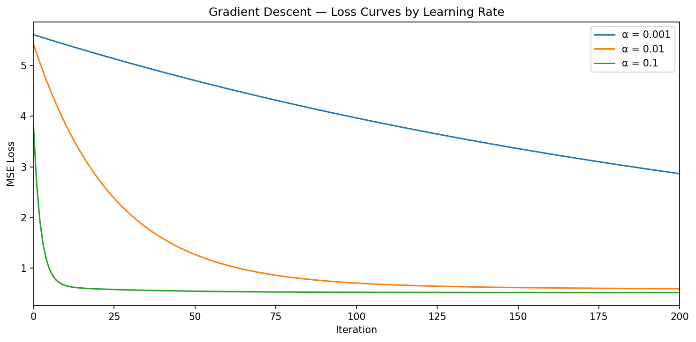
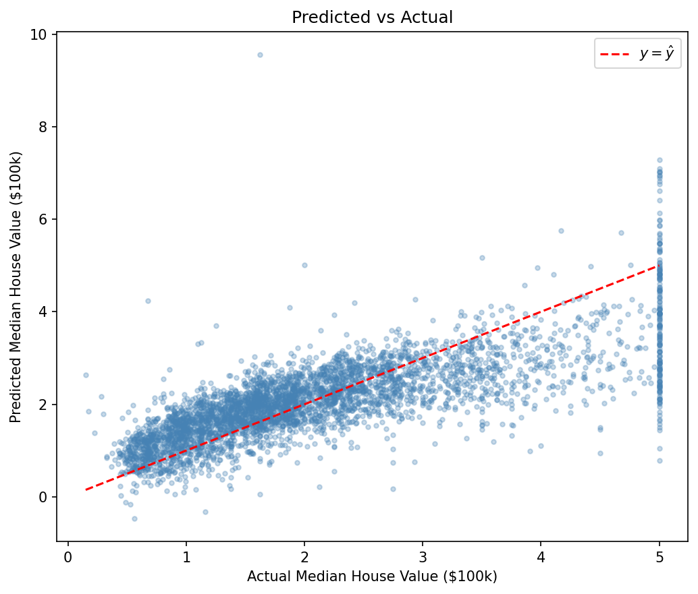

# Linear Regression from Scratch
### Predicting California Housing Prices with Multivariate Linear Regression and Gradient Descent

---

## Overview

This project implements multivariate linear regression entirely from scratch 
using NumPy without sklearn, autograd or black boxes. Every mathematical 
operation is implemented explicitly, from the loss function to the gradient 
update rule, with the goal of demonstrating a thorough understanding of the 
mathematics of supervised learning.

---

## Mathematical Foundation

**Hypothesis function:**

$$\hat{y} = X\theta$$

**Mean Squared Error loss:**

$$J(\theta) = \frac{1}{m} \sum_{i=1}^{m} (\hat{y}_i - y_i)^2$$

**Gradient of MSE:**

$$\frac{\partial J}{\partial \theta} = \frac{2}{m} X^T(X\theta - y)$$

**Gradient descent update rule:**

$$\theta := \theta - \alpha \cdot \frac{\partial J}{\partial \theta}$$

---

## Project Structure

```
linear-regression-from-scratch/
│
├── linear_regression.ipynb   # Main notebook
├── requirements.txt          # Dependencies
├── plots/                    # Generated visualisations
└── README.md
```

---

## Key Results

| Metric | Value  |
|--------|--------|
| MSE    | 0.5546 |
| RMSE   | 0.7447 |
| R²     | 0.5768 |


**Loss curves — learning rate comparison:**



**Predicted vs Actual:**



---

## Concepts Demonstrated

- Mean Squared Error loss function and its analytical gradient derivation
- Gradient descent optimisation
- Feature standardisation and its effect on training, with comparison to min-max scaling
- Model evaluation metrics: MSE, RMSE, and R²
- Model evaluation plots: Predicted vs Actual, Residuals, and Feature Coefficients

---

## Limitations

- **Linearity assumption** — the relationship between features and house prices 
  is not perfectly linear, confirmed by the residuals plot
- **Outliers** — extreme values in `AveOccup` and `Population` still 
  influence the learned weights despite standardisation
- **Feature engineering** — raw features used as-is; polynomial features 
  would likely improve R²
- **Fixed learning rate** — adaptive methods such as Adam would converge 
  faster and more reliably

---

## Setup

```bash
git clone <repo-url>
pip install -r requirements.txt
jupyter notebook
```

---

## So Far...

This is the first project in a series building core ML algorithms from scratch:

1. **Linear Regression** — gradient descent on a regression problem ← you are here
2. Logistic Regression — gradient descent on a classification problem
3. PCA Visualiser — dimensionality reduction via eigendecomposition
4. Naive Bayes Classifier — probabilistic classification from scratch

## Part of a Series

| # | Project | Status |
|---|---------|--------|
| 1 | Linear Regression from Scratch | ✅ Complete |
| 2 | [Logistic Regression from Scratch](https://github.com/groovyds/logistic-regression) | ✅ Complete |
| 3 | [PCA Visualiser](https://github.com/groovyds/pca-visualizer) | ✅ Complete |
| 4 | Naive Bayes Classifier | ⏳ Upcoming |
